# VGA Air Drawing

본 프로젝트는 OV7670 카메라로 초록색 마커를 추적하고, 허공에서 생성된 궤적을 Basys 3 FPGA 내부에서 카메라 영상과 실시간으로 합성하도록 구현한 시스템임. 펜 좌표 검출, 선 보간, 브러시 렌더링 및 영상 합성은 FPGA에서 수행하며, PC 프로그램은 결과 표시와 도구 설정 및 이미지 저장을 담당함.

프로젝트는 320×240 프레임버퍼를 사용하는 **v1 기준 설계**와 640×480 영상을 64라인 단위로 전송하는 **v2 라인 링버퍼 개선 설계**로 구성됨. 본 문서는 v1의 전체 동작을 먼저 설명한 후, v2에서 변경된 영상 전송 구조와 추적 방식을 별도로 기술함.

## 개발 및 검증 환경

| 구분 | 사용 환경 |
| --- | --- |
| HDL / 소프트웨어 | SystemVerilog, Python 3.12.10 |
| 설계·구현 | Vivado 2020.2 |
| 검증 | Synopsys VCS 2024.09-SP1, UVM 1.2 |
| 하드웨어 | Basys 3 (Artix-7 XC7A35T), OV7670, FW171 VGA 캡처보드 |

## 1. 프로젝트 개요

FPGA는 카메라 영상에서 초록색 마커를 추적하고, 마커의 이동 경로를 카메라 배경과 실시간으로 합성함. PC UI는 합성 결과 표시, 도구 설정 및 이미지 저장을 담당함.

<p align="center">
  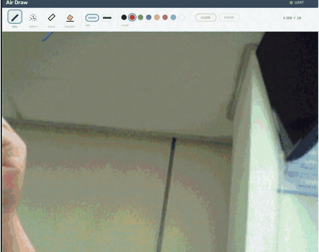
</p>

- 입력: 초록색 마커와 OV7670 영상, Basys 3 버튼, PC UI
- 출력: VGA 화면, PC 오버레이 UI

| 기능 | 내용 |
| --- | --- |
| 펜 종류 | 볼펜 / 스프레이 / 캘리그래피 / 지우개 |
| 펜 굵기 | 2단계 |
| 펜 색상 | RGB 3bit 기반 8색 |
| 도화지 모드 | 카메라 배경과 흰 배경 전환 |
| 캡처 모드 | 배경을 정지한 상태에서 드로잉 계속 수행 |
| 이미지 저장 | 현재 합성 화면을 PNG로 저장 |
| 이중 입력 | 보드 버튼과 PC UI에서 도구 상태 제어 |

**Basys 3 버튼 조작**

| 입력 | 동작 |
| --- | --- |
| BTNU | 볼펜 → 스프레이 → 캘리그래피 순서로 도구 변경 |
| BTND | 현재 도구의 굵기 변경 |
| BTNL | 지우개 모드 전환 |
| BTNR | 캔버스 전체 지우기 |
| BTNC | OV7670 카메라 설정 재전송 |
| SW15 | 시스템 전체 리셋 |

## 2. 저장소 구조

본 저장소는 동일 프로젝트의 두 설계를 함께 유지함. v1은 전체 기능의 기준 설계이며, v2는 BRAM 사용량과 출력 해상도를 개선하기 위해 영상 버퍼 구조를 변경한 설계임.

| 폴더 | 내용 |
| --- | --- |
| [`v1-framebuffer/`](v1-framebuffer/) | 기준 설계. 320×240 프레임버퍼, 바운딩박스 기반 마커 추적 및 PC UI 포함 |
| [`v2-line-header/`](v2-line-header/) | 개선 설계. 64라인 링버퍼, 라인 헤더 전송 및 PC 프레임 재조립 기능 포함 |
| [`backup/`](backup/) | 초기 RTL 스냅샷 |

```text
VGA_Air_Draw/
├── v1-framebuffer/
│   ├── python_ui/                    # v1 캡처 화면 및 UART 제어 UI
│   ├── vga_uart_project/             # v1 Vivado 프로젝트와 비트스트림
│   └── README_KR.md                  # v1 CAPTURE/SAVE 구현 노트
├── v2-line-header/
│   ├── python_ui/                    # v2 라인 재조립 UI와 수신 진단 도구
│   ├── vga_uart_project/             # v2 Vivado 프로젝트와 구현 리포트
│   ├── visualization/                # 설계 동작 인터랙티브 시각화
│   └── README.md                     # v2 상세 설계 문서
├── docs/                             # 루트 README 이미지
└── README.md
```

## 3. v1 프레임버퍼 FPGA 설계

v1은 카메라 영상을 320×240 RGB565 프레임버퍼에 저장하고, 동일 해상도의 4bit 캔버스를 VGA 출력 단계에서 합성하는 구조임. 영상 경로와 드로잉 경로를 분리하여 마커 추적 중에도 카메라 배경을 계속 표시하도록 구성함.


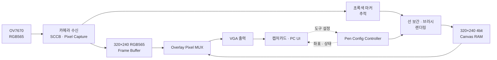

### 3.1 영상 저장 및 출력

`ov7670_memcontroller`는 카메라가 연속으로 전달하는 두 개의 8bit 데이터를 RGB565 한 픽셀로 조립함. 조립된 픽셀은 카메라 PCLK 도메인에서 프레임버퍼에 기록되고, VGA 읽기 도메인에서 순차적으로 출력됨.

| 메모리 | 구성 | 데이터 크기 |
| --- | --- | ---: |
| 카메라 프레임버퍼 | 320×240×16bit | 153.6 KB |
| 드로잉 캔버스 | 320×240×4bit | 38.4 KB |
| 합계 | 영상과 캔버스를 별도 저장 | 192.0 KB |

VGA 타이밍은 640×480으로 생성하지만 v1 프레임버퍼의 유효 좌표는 320×240임. 별도 확대 처리를 적용하지 않으므로 카메라 영상과 캔버스가 화면 좌상단 영역에 표시됨.

### 3.2 캔버스 합성

캔버스 한 픽셀은 `{valid, R, G, B}` 4bit로 저장됨. `valid=1`이면 선택한 RGB 색상을 출력하고, `valid=0`이면 카메라 프레임버퍼의 픽셀을 통과시킴. 흰 도화지 모드에서는 카메라 픽셀 대신 흰색 배경을 사용함.

`CLEAR` 입력은 76,800개 캔버스 주소를 순차적으로 0으로 기록함. 지우개는 브러시 범위에 `valid=0`을 기록하므로 배경 영상 또는 흰 도화지가 다시 나타나게 됨.

### 3.3 상태 제어와 캡처 모드

`pen_config_controller`가 색상·굵기·브러시·지우개·도화지·캡처 상태의 단일 소유자로 동작함. 물리 버튼과 UART 명령은 해당 모듈을 통해서만 최종 상태에 반영됨.

캡처 모드에서는 프레임버퍼의 카메라 쓰기만 중지하여 마지막 배경 프레임을 고정함. 캔버스 쓰기와 VGA 읽기는 계속 동작하므로 정지된 배경 위에서 새로운 선을 추가할 수 있음.

## 4. v1 마커 추적 및 드로잉 파이프라인

v1의 마커 좌표는 색상 판정, 3픽셀 침식, 바운딩박스 중심 계산 및 이동평균 순서로 생성됨. 확정된 좌표는 Bresenham 보간기와 브러시 렌더러를 거쳐 캔버스 RAM 쓰기 데이터로 변환됨.

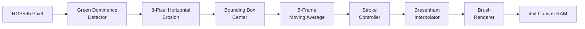

### 4.1 초록색 마커 판정과 노이즈 제거

`colour_detector`는 HSV 변환 없이 RGB565 채널의 상대 우세도를 비교함. R/B 채널을 6bit로 확장한 뒤 다음 조건을 모두 만족하는 픽셀만 초록색 후보로 판정함.

```text
G >= 36
G - R >= 16
G - B >= 16
```

색상 후보가 같은 행에서 3픽셀 연속 검출된 경우에만 유효 hit로 사용함. 나눗셈 기반 색공간 변환 없이 고립된 단일 픽셀을 제거하여 조합 논리와 마커 흔들림을 함께 줄임.

<p align="center">
  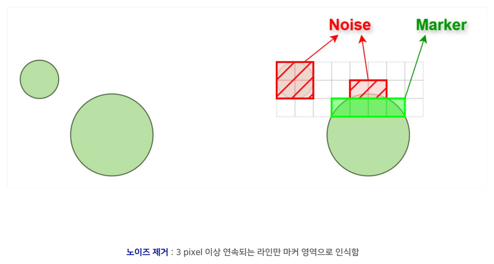
</p>

### 4.2 바운딩박스 중심점과 좌표 평활화

`bbox_center_accum`은 한 프레임 동안 검출 영역의 `min_x`, `max_x`, `min_y`, `max_y`를 갱신함. 유효 hit가 15개 이상이면 `(min+max)/2`로 중심점을 계산하고 Pen Down으로 판정함. 프레임 전체를 저장하지 않고 경계값만 누적하므로 메모리 사용량이 작음.

`coord_filter`는 최근 5개 좌표의 running sum을 유지함. 매 프레임 `기존 합 - 가장 오래된 좌표 + 신규 좌표`만 계산하며, 5로 나누는 연산은 `×205 >> 10`으로 근사함. 최초 Pen Down 시에는 큐 전체를 첫 좌표로 채워 원점에서 마커까지 불필요한 선이 생성되는 현상을 방지함.

<p align="center">
  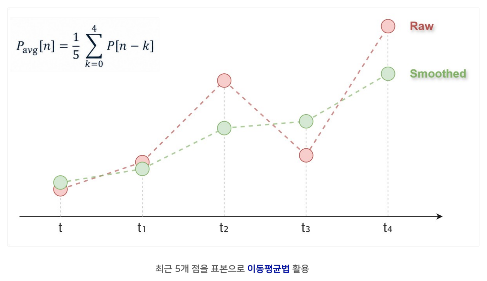
</p>

### 4.3 선 보간과 브러시 렌더링

프레임마다 생성되는 중심 좌표만 캔버스에 기록하면 빠르게 이동할 때 점 사이가 끊어짐. `brush_draw_engine`은 이전 좌표와 현재 좌표 사이를 Bresenham 방식으로 보간하고 각 보간점에 브러시 마스크를 적용함.

| 모듈 | 역할 |
| --- | --- |
| `brush_stroke_controller` | 이전·현재 좌표로 선분을 구성하고 색상·굵기·지우개 속성을 고정함 |
| `bresenham_interpolator` | 곱셈과 나눗셈 없이 오차항 누적으로 선분 좌표를 생성함 |
| `circular_brush_renderer` | 보간점 주변을 순회하며 브러시별 캔버스 쓰기 데이터를 생성함 |

| 브러시 | 픽셀 판정 방식 |
| --- | --- |
| 볼펜 | `dx² + dy² <= threshold`인 원형 영역을 채움 |
| 스프레이 | 원형 영역 안에서 좌표 hash와 density 조건을 만족하는 픽셀만 기록함 |
| 캘리그래피 | `\|dy-dx\| <= width` 조건을 만족하는 사선 영역을 기록함 |
| 지우개 | 원형 마스크 범위의 `valid` 값을 0으로 기록함 |

<p align="center">
  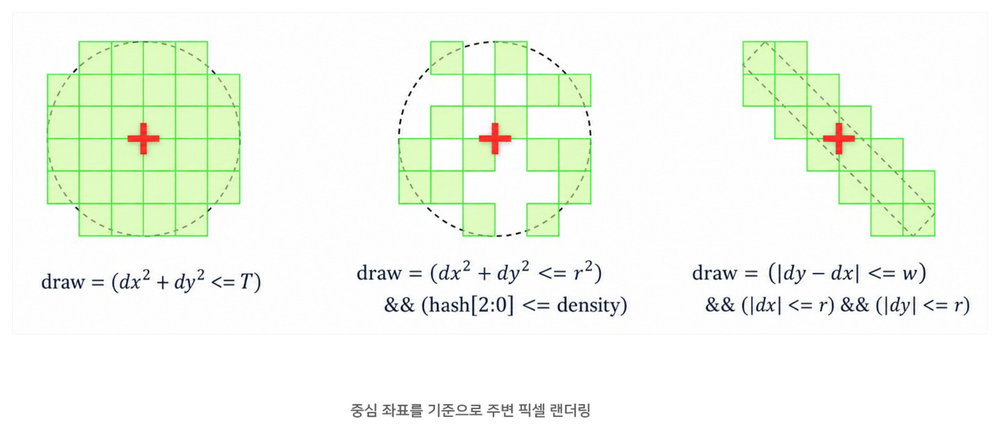
</p>

마커가 사라지면 현재 스트로크를 종료함. 이후 다른 위치에서 다시 검출되더라도 이전 좌표와 새 좌표를 연결하지 않으므로 Pen Up 구간에 불필요한 선이 생성되지 않음.

## 5. v1 구현 결과

v1은 320×240 영상 프레임버퍼와 별도의 드로잉 캔버스를 BRAM에 구현함. Vivado 2020.2 implementation 결과는 다음과 같음.

| 항목 | 사용량 | 비율 |
| --- | ---: | ---: |
| Slice LUTs | 1,058 / 20,800 | 5.09% |
| Slice Registers | 916 / 41,600 | 2.20% |
| Block RAM Tile | 48 / 50 | 96.00% |
| DSPs | 4 / 90 | 4.44% |
| IOBs | 36 / 106 | 33.96% |

타이밍 조건은 모두 충족됨. LUT와 레지스터 사용량은 낮지만 BRAM 사용률이 96%에 도달하여 해상도 확장이나 영상 처리용 추가 버퍼를 배치하기 어려운 상태임. 해당 메모리 한계를 해결하기 위해 v2에서 프레임버퍼를 라인 링버퍼로 변경함.

## 6. v1 UVM 검증

Synopsys VCS 2024.09-SP1과 UVM 1.2를 사용하여 v1의 주요 기능 모듈을 개별 검증함. sequence에서 정상·경계·랜덤 transaction을 생성하고, monitor와 scoreboard가 DUT 출력과 reference 결과를 cycle 단위로 비교하도록 구성함. 총 9개 모듈에서 **0 FAIL, 계획된 기능 커버리지 100%**를 달성함.

| 모듈 | 주요 확인 대상 | 테스트 구성 | 결과 |
| --- | --- | --- | --- |
| `ov7670_memcontroller` | RGB565 픽셀 조립 및 write event | 랜덤 픽셀 150회, RGB 조합·교차 | PASS (100%) |
| `uart_packet_decoder` | start/end 인식과 비정상 패킷 제거 | 랜덤 패킷 50회 | PASS (100%) |
| `uart_packet_sender` | 펜 상태의 6byte 패킷 변환 | 랜덤 패킷 50회 | PASS (100%) |
| `pen_config_controller` | UART와 물리 버튼의 상태 반영 | 랜덤 UART·버튼 각 50회 | PASS (100%) |
| `bbox_center_accum` | 마커 영역의 바운딩박스 중심 계산 | random·corner·stress 10,000회 | PASS (100%) |
| `coord_filter` | jitter·spike·Pen Up 처리 | basic·jitter·spike·random 250회 | PASS (100%) |
| `brush_stroke_controller` | 선 연결, 지우개, 굵기, Pen Up | random·stress 10,000회 | PASS (100%) |
| `bresenham_interpolator` | 수평·수직·대각선 및 경계 보간 | boundary 13회 + random 1,000회 | PASS (100%) |
| `circular_brush_renderer` | 브러시·텍스처·색상별 RAM 쓰기 | random·boundary·stress 10,000회 | PASS (100%) |

<p align="center">
  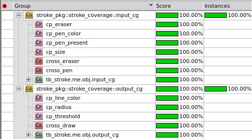
</p>

<p align="center"><sub>`brush_stroke_controller` 기능 커버리지 결과 예시</sub></p>

### 6.1 도달 불가능한 coverage bin 처리

`brush_stroke_controller`의 cross coverage에는 RTL 구조상 생성될 수 없는 조합이 포함되어 있었음. 지우개 모드의 radius는 5 또는 7로 제한되므로 `지우개 색상 × radius 2/3` 조합은 발생할 수 없음. 해당 조합은 설계 근거를 확인한 후 `ignore_bins`로 명시하여 실제 도달 가능한 상태 공간을 기준으로 coverage를 계산함.

### 6.2 랜덤 검증의 사각지대 보완

`bresenham_interpolator`는 무작위 좌표만으로 음수 방향, 수직선, 대각선 및 zero-length 선이 충분히 생성되지 않았음. 화면 네 모서리, 축 정렬 선, 양·음수 방향 및 동일한 시작·끝 좌표를 포함한 directed boundary test를 추가하여 랜덤 검증의 사각지대를 보완함.

100% 수치는 정의된 기능 bin의 달성률을 의미하며 모든 입력 조합에 대한 형식 검증을 의미하지 않음. v2 전용 `centroid_accum`, `camera_line_ring`, `async_line_fifo`, `vga_line_streamer`는 위 9개 모듈 집계에 포함되지 않음.

## 7. v2 라인 링버퍼 개선 설계

v2는 v1의 드로잉, 캔버스 및 UART 구조를 유지하면서 카메라 영상 저장부와 마커 중심점 계산 방식을 개선함. 핵심 변경점은 전체 프레임을 FPGA에 저장하지 않고 최근 64라인만 보관한 뒤, 라인의 원본 위치 정보를 VGA 화면에 함께 실어 PC에서 완성 프레임을 재구성하는 방식임.

### 7.1 설계 변경 배경

640×480 RGB565 한 프레임은 614.4 KB이며 이를 그대로 저장하려면 RAMB36이 최소 134개 필요함. Basys 3에는 RAMB36이 50개만 존재하므로 풀 프레임버퍼 방식으로 VGA 해상도를 저장할 수 없음.

v1은 저장 해상도를 320×240으로 낮춰 문제를 해결했지만 BRAM의 96%를 사용하고 출력 영역도 제한됨. v2는 RGB444 형식의 640×64 라인 링버퍼를 사용하여 영상 payload를 61.44 KB로 줄임. 풀 프레임 저장 방식과 비교하면 논리적인 영상 저장량이 90% 감소함.


<p align="center">
  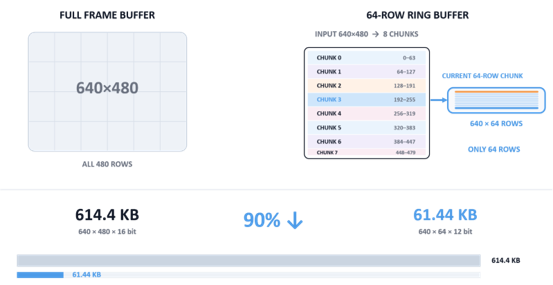
</p>

### 7.2 라인 저장과 Clock Domain Crossing

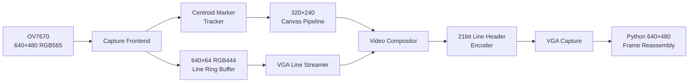

카메라 PCLK 도메인은 수신한 라인을 링버퍼 bank에 기록하고 `{source row, bank number}` descriptor만 64단 async FIFO로 전달함. VGA 도메인의 line streamer는 descriptor를 POP한 뒤 해당 bank에서 640픽셀을 읽음. 픽셀 전체가 아니라 주소 정보만 CDC 경로를 통과하므로 동기화 비용이 감소함.

라인 데이터는 VGA display area에서 출력하고, 다음 라인 주소는 수평 porch 구간에서 전달함. 화면에 표시되지 않는 블랭킹 시간을 제어 경로에 사용하여 영상 출력과 descriptor 처리가 겹치지 않도록 구성함.

<p align="center">
  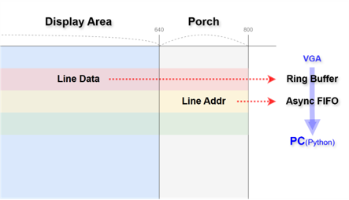
</p>

### 7.3 21bit 라인 헤더와 PC 프레임 재조립

v2는 각 원본 행을 VGA의 두 행에 반복 출력함. 첫 번째 행에는 영상 640픽셀을 전송하고, 두 번째 행의 마지막 21컬럼에는 시작 패턴, valid, 4bit frame ID, 9bit source y 및 4bit checksum을 기록함.

```text
VGA 화면 A ──> 원본 rows 0…239   (각 원본 row를 2회 출력)
VGA 화면 B ──> 원본 rows 240…479 (각 원본 row를 2회 출력)

복제 row 1 : 영상 columns 0…639
복제 row 2 : 영상 columns 0…618 + 21bit line header
```

`v2-line-header/python_ui/air_draw_ui.py`는 캡처된 두 row parity의 헤더를 검사하고 checksum-valid 헤더가 많은 쪽을 선택함. `frame ID`와 `source y`에 따라 행을 원래 위치에 배치하며 480행이 모두 수신된 프레임만 UI에 게시함. 미완성 프레임은 최대 3개까지 관리하고 캡처 재동기화가 발생하면 오래된 조립 상태를 폐기함.

25 MHz VGA 기준 화면 전송률은 약 59.98 Hz임. 원본 한 프레임을 화면 A와 B로 나누어 운반하므로 완성 프레임의 이론적 상한은 약 29.99 fps이며, 실제 캡처 경로는 약 28~29 fps를 처리함.

### 7.4 센트로이드 기반 마커 추적

v1의 바운딩박스 중심은 원거리 오검출 한 점에도 최솟값 또는 최댓값이 크게 변하는 한계가 있음. v2의 `centroid_accum`은 유효 픽셀의 `Σx`, `Σy`, 개수 `N`을 누적하고 `cx=Σx/N`, `cy=Σy/N`으로 중심점을 계산함.

| 항목 | v2 설정 | 목적 |
| --- | ---: | --- |
| 초록색 판정 | `G >= 16`, `G - max(R,B) > 8` | RGB444 변환 이후의 마커 후보 검출 |
| 유효 픽셀 수 | 15~1,200 | 지나치게 작거나 큰 초록 영역 제외 |
| 추적 게이트 | 이전 중심 기준 x·y 각각 ±48 | 다른 초록색 물체의 누적 방지 |
| 추적 해제 | 연속 3프레임 미검출 | 일시 누락과 실제 Pen Up 구분 |
| 좌표 출력 | 센트로이드 + 5프레임 평균 | 오검출 영향과 프레임 간 흔들림 감소 |

### 7.5 v1/v2 구현 결과 비교

| 항목 | v1 프레임버퍼 | v2 라인 링버퍼 |
| --- | ---: | ---: |
| 영상 구성 | 320×240 RGB565 | 640×64 RGB444 |
| Slice LUTs | 1,058 / 20,800 (5.09%) | 1,401 / 20,800 (6.74%) |
| Slice Registers | 916 / 41,600 (2.20%) | 1,290 / 41,600 (3.10%) |
| Block RAM Tile | 48 / 50 (96%) | 36 / 50 (72%) |
| 표시 결과 | 320×240 영역 | PC에서 640×480 완성 프레임 복원 |
| 마커 중심 | 바운딩박스 중점 | 센트로이드 + 추적 게이트 |

v2의 BRAM 36개는 카메라 링버퍼 24개와 캔버스 12개로 구성됨. 라인 payload만 계산하면 RAMB36 약 14개에 해당하지만, 실제 구현에서는 bank 분할과 포트 구성을 포함하여 카메라 경로에 24개가 배치됨. 전체 BRAM 사용률은 v1보다 24%p 감소함.

v2 implementation의 WNS는 **+1.519 ns**, WHS는 **+0.023 ns**이며 실패 엔드포인트는 0개임. 카메라 동작점은 XCLK 22.980769 MHz, `CLKRC=0x02`, 실측 PCLK 약 15.15 MHz 및 약 20 fps임.

| v1 — 320×240 | v2 — 640×480 |
| :---: | :---: |
|  |  |

## 8. 문서

- [v1 CAPTURE/SAVE 구현 노트](v1-framebuffer/README_KR.md)
- [UART 패킷 규격](v1-framebuffer/vga_uart_project/vga_uart_project.srcs/README_KR.md)
- [v2 초기 설계 문서](backup/README.md) — 초기 RTL 구성과 드로잉 엔진 구조
- [v2 상세 설계 문서](v2-line-header/README.md) — 모듈별 동작, 클록 계산, 라인 헤더 규격 및 프레임 재조립 순서
- [`full-frame-vs-line-ring.html`](v2-line-header/visualization/full-frame-vs-line-ring.html) — 프레임버퍼와 라인 링버퍼의 단계별 동작 비교
- [`green-centroid-tracker.html`](v2-line-header/visualization/green-centroid-tracker.html) — 바운딩박스 중심과 센트로이드 추적 비교

## 9. 문제 해결

**물리 버튼과 PC UI의 상태 충돌**

보드와 PC가 펜 상태를 각각 보관하면 한쪽에서 변경한 값이 다음 입력에서 이전 값으로 되돌아가는 문제가 발생함. `pen_config_controller`를 최종 상태의 단일 소유자로 지정하고 UART 명령과 debounced button event를 해당 모듈에서만 반영하도록 변경함.

갱신 규칙은 last-write-wins이며 같은 clock에 입력이 겹치면 물리 버튼을 우선함. FPGA가 실효 상태를 TX 패킷으로 echo하고 PC UI가 수신 상태로 화면을 갱신하도록 구성하여 양쪽 표시를 일치시킴.

**캡처 화면의 경계 노이즈**

VGA 캡처카드 출력에는 환경에 따라 좌측 색상 노이즈와 검은 블랭킹 영역이 포함될 수 있음. v1 UI는 좌측 12픽셀을 우선 제거하고 초기 30프레임의 밝기를 분석하여 검은 테두리를 보정함. 캡처 장치가 변경되어 화면이 잘리거나 테두리가 남는 경우 `CROP_LEFT`, `CALIB_FRAMES`, `BLACK_THR` 값을 조정해야 함.

**UVM 기능 커버리지 미달**

무작위 반복 횟수를 늘려도 일부 cross bin이 0 hit으로 유지되는 문제가 있었음. 지우개 색상과 작은 radius처럼 RTL 구조상 발생할 수 없는 조합은 설계 근거를 확인한 후 `ignore_bins`로 제외함. 발생 가능하지만 랜덤 확률이 낮은 수직·대각선·음수 방향 선은 directed test로 보완함.

**라인 헤더 위상 불일치**

캡처카드 재동기화가 발생하면 헤더가 VGA의 짝수 또는 홀수 행 중 어느 쪽에 나타나는지가 바뀔 수 있음. 고정된 parity만 읽으면 정상 라인을 절반 이상 놓치고 프레임 조립이 중단됨.

v2 UI는 두 parity의 21bit 헤더를 모두 해독하고 유효 checksum 수가 많은 쪽을 선택함. `CROP_LEFT=16`으로 예약된 좌측 경계를 제거하며 일정 시간 동안 정상 헤더가 없으면 조립기를 초기화함. 캡처 read가 연속 실패하면 DirectShow 장치를 다시 열어 복구함.

**높은 PCLK에서 발생한 색상 결함**

전송 경로를 약 28~29 fps까지 높였을 때 line count와 checksum은 정상이었지만 밝은 장면에서 자홍색·노란색 점 결함이 발생함. 전송 프로토콜이 아니라 높은 PCLK에서 D[7:0], HREF 및 VSYNC의 setup/hold 여유가 감소한 것이 원인이었음.

<p align="center">
  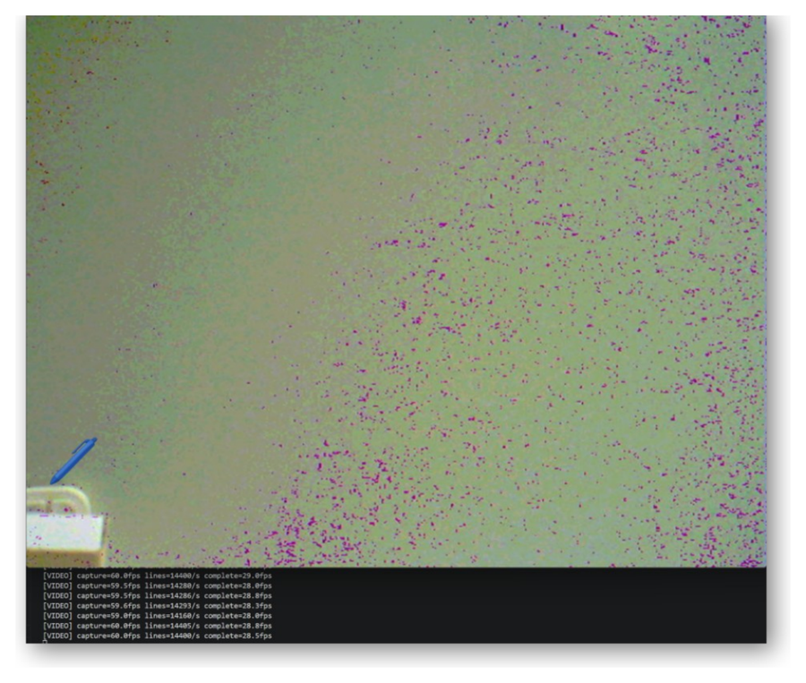
</p>

카메라 입력을 IOB register에서 먼저 수신하도록 구성하고 `CLKRC=0x02`로 PCLK를 낮춤. 현재 설정은 최대 전송 처리량보다 영상 안정성을 우선한 동작점임.
