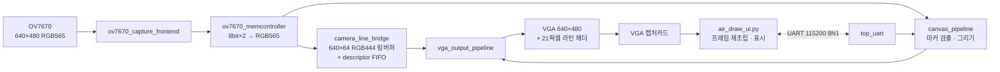

# VGA Air Drawing

본 프로젝트는 OV7670 카메라를 이용해 초록색 마커를 추적하고, 허공에서 생성된 궤적을 Basys 3 FPGA 내부에서 카메라 영상과 실시간으로 합성하도록 구현한 시스템임. 합성 결과는 VGA와 캡처카드를 거쳐 PC의 Python UI에 표시되며, 펜 색상·굵기·질감 설정은 UART를 통해 양방향으로 전달됨.

그리기 연산은 모두 FPGA 내부에서 수행됨. PC는 합성 결과를 표시하고 도구 설정을 전달하는 사용자 인터페이스 역할만 담당함.


## 개발 및 검증 환경

| 구분 | 사용 도구 |
| --- | --- |
| 언어 | SystemVerilog, Python 3.12.10 |
| 설계·구현 | Vivado 2020.2 |
| 검증 | Synopsys VCS 2024.09-SP1, UVM 1.2 |
| 하드웨어 | Basys 3 (Artix-7 XC7A35T), OV7670 카메라 모듈, FW171 VGA 캡처보드 |

## 시스템 구성


카메라 픽셀 데이터는 두 경로로 분기됨. 첫 번째 경로는 **펜 컨트롤러**에서 마커 좌표를 검출하고 캔버스 데이터를 생성함. 두 번째 경로는 **메모리 컨트롤러**를 거쳐 카메라 영상을 버퍼에 저장함. 두 경로의 출력은 VGA 출력 직전에 합성됨. 영상 버퍼는 카메라 및 드로잉 경로의 쓰기 타이밍과 VGA 읽기 타이밍을 분리하는 역할을 수행함.

UART는 영상 경로와 독립된 제어 채널로 구성됨. 해당 채널은 펜 색상·크기·모양과 reset·clear 제어 신호만 양방향으로 전송함.

위 시스템 구조도는 v1을 기준으로 함. v2에서는 **영상 버퍼만** 라인 링버퍼로 변경하였으며, 나머지 처리 흐름은 동일하게 유지됨. v2의 실제 모듈 연결은 다음과 같음.



## 저장소 구조

본 저장소는 동일 프로젝트의 두 세대를 포함함. 설계 변경 과정과 구현 결과를 비교할 수 있도록 v1과 v2를 모두 유지함.

| 폴더 | 내용 |
| --- | --- |
| [`v2-line-header/`](v2-line-header/) | **현재 버전.** 64라인 링버퍼 + 라인 헤더 방식. RTL 41개 |
| [`v1-framebuffer/`](v1-framebuffer/) | 이전 버전. 프레임버퍼 방식. RTL 33개 |
| [`backup/`](backup/) | 초기 RTL 스냅샷 |

각 버전 폴더의 기본 구성은 다음과 같음.

```text
v2-line-header/
├── python_ui/
│   ├── air_draw_ui.py       # 영상 재조립, UART 통신, 드로잉 UI
│   ├── capture_probe.py     # 프레임 수신 속도 진단 도구
│   └── assets/              # 펜·스프레이·대각선·지우개 마커 이미지
├── vga_uart_project/
│   ├── vga_uart_project.xpr           # Vivado 2020.2 프로젝트
│   ├── vga_uart_project.srcs/
│   │   ├── sources_1/                 # SystemVerilog RTL
│   │   └── constrs_1/Basys-3-Master.xdc
│   ├── vga_uart_project.runs/impl_1/top_airDrawing.bit
│   └── *.rpt                          # synth/impl 타이밍·리소스 리포트
└── visualization/           # 설계 비교용 시각화 (HTML)
```

## v1–v2 영상 전송 구조 비교

v1에서 v2로 전환하면서 가장 크게 변경된 부분은 영상 버퍼와 전송 구조임.

**640×480 RGB565 한 프레임의 크기는 614.4 KB임. 이를 저장하려면 RAMB36이 최소 134개 필요하지만, Basys 3에는 50개만 존재함.** 따라서 풀 프레임버퍼 방식은 대상 FPGA의 자원 범위에서 구현할 수 없음.

v1은 저장 해상도를 320×240 QVGA로 낮춰 메모리 사용량을 153.6 KB로 제한함. 그러나 저장 해상도를 그대로 출력하므로 카메라 영상은 **640×480 화면의 좌상단 1/4에만** 표시됨.

v2는 프레임 전체를 저장하지 않고 **최근 64라인만 링버퍼에 유지하며, 픽셀 포맷을 RGB444로 변환함.** 전체 480행은 64행 단위의 8개 구간으로 나누어 전송함. 이 구조의 영상 payload는 61.44 KB이며, 이론상 RAMB36 14개만 필요하므로 풀 프레임버퍼 대비 메모리 요구량이 **90% 감소함.**


라인 단위 전송에서는 FPGA가 현재 라인의 원본 위치를 PC에 전달해야 함. 이를 위해 각 라인의 끝 **21컬럼에 헤더**를 삽입하여 `source frame ID + source row + checksum`을 함께 전송함. PC의 Python 프로그램은 해당 헤더를 해석하고 각 라인을 배열의 원래 위치에 배치하여 640×480 프레임을 복원함.

즉, **프레임 조립 기능을 FPGA의 메모리 영역에서 PC의 소프트웨어 영역으로 이전한 구조**임. 이를 통해 FPGA 메모리 사용량을 줄이는 동시에 출력 해상도를 4배로 확장함.

| | v1 | v2 |
| --- | --- | --- |
| 영상 버퍼 | 320×240 RGB565 프레임버퍼 | 640×64 RGB444 링버퍼 |
| 영상 payload | 153.6 KB | **61.44 KB** |
| 표시 영역 | 화면 좌상단 1/4 (320×240) | 전체 화면 (640×480) |
| 프레임 조립 | 불필요 (FPGA가 그대로 출력) | PC (파이썬이 헤더로 재조립) |
| 마커 추적 | 바운딩박스 중점 | 센트로이드 + 추적 게이트 |
| 비트스트림 | 812 KB | **735 KB** |
| RTL 모듈 | 33개 | 41개 |

### 해상도 및 BRAM 사용량 비교

동일한 장면을 v1과 v2로 촬영하고 같은 표시 크기로 비교함.

| v1 — 320×240 | v2 — 640×480 |
| :---: | :---: |
|  |  |

다음 표는 세 가지 합성 조건의 FPGA 자원 사용량을 비교한 결과임.

| | v1 (320×240) | v2 (320×240) | v2 (640×480, 현재) |
| --- | --- | --- | --- |
| **BRAM** | **96 %** | **36 %** | **72 %** |
| LUT | 5 % | 6 % | 7 % |
| FF | 2 % | 3 % | 3 % |
| IO | 34 % | 34 % | 35 % |

비교 결과는 다음 두 가지 관점으로 해석할 수 있음.

**동일 해상도 비교** — v1은 320×240 구성에서 BRAM의 96%를 사용하여 추가 기능을 수용하기 어려움. 반면 v2는 동일한 320×240 영상을 BRAM **36%**로 처리함.

**현재 설정 비교** — v2는 해상도를 4배 높인 640×480 구성에서도 BRAM **72%**를 사용함. 이는 v1의 320×240 구성에서 사용한 96%보다 낮음. 세 조건의 로직 자원(LUT·FF) 사용량은 유사하므로, 자원 사용량의 차이는 메모리 구조 변경에서 발생한 것으로 판단할 수 있음.

### VGA 화면 분할 전송

카메라 한 프레임(480행)은 각 원본 행을 수직 방향으로 두 번 출력하므로 VGA 화면 한 장에 모두 포함되지 않음. 따라서 **전송 화면 A는 원본 rows 0–239를, 화면 B는 rows 240–479를** 분할하여 운반함. A와 B는 서로 다른 프레임이 아니라 동일 원본 프레임의 상·하단 절반에 해당함.

```text
VGA 화면 A ──> 원본 rows 0…239   (각 row를 2번 출력 → 480 VGA rows)
VGA 화면 B ──> 원본 rows 240…479 (각 row를 2번 출력 → 480 VGA rows)

복제 row 1 : 영상 columns 0…639
복제 row 2 : 영상 columns 0…618 + 끝 21컬럼 헤더
```

25 MHz ÷ (800 × 521) = 59.9808 Hz이므로 VGA 화면 한 장의 전송 시간은 16.67 ms이며, 두 화면의 전송 시간은 33.34 ms임. 따라서 **완성 프레임의 이론적 상한은 약 30 fps**임. 현재 카메라의 동작 속도는 약 20 fps이므로 전송 경로는 시스템 병목으로 작용하지 않음.

### Clock Domain Crossing 구조

PCLK(약 15 MHz)와 VGA 출력 도메인(100 MHz) 사이로 640픽셀 전체를 전달할 경우 CDC 비용이 증가함. v2는 **영상 픽셀을 링버퍼 bank에 유지하고, `{카메라 row 번호, bank 번호}` descriptor만 64단 async FIFO를 통해 전달함.** 출력 측 line streamer는 descriptor를 POP한 후 해당 bank의 640픽셀을 직접 읽음. 따라서 clock domain 사이를 전달하는 정보는 픽셀 데이터가 아닌 주소 정보로 제한됨.

주소 전달 시점은 화면 출력 구간과 중첩되지 않도록 구성함. 픽셀 데이터는 display area(x 0–639)에서 출력하며, **라인 주소는 이후의 porch 구간(x 640–799)에서 FIFO를 통해 전달함.** 이를 통해 수평 블랭킹 시간을 제어 경로에 활용함.

## 구현 결과

다음은 v2 기준 Vivado 2020.2 implementation 리포트의 결과임.

| 항목 | 사용량 | 비율 |
| --- | --- | --- |
| Slice LUTs | 1,401 / 20,800 | 6.74 % |
| Slice Registers | 1,290 / 41,600 | 3.10 % |
| Block RAM Tile | 36 / 50 | 72.00 % |

전체 BRAM 36개는 **카메라 링버퍼 24개와 캔버스 12개**로 구성되며, 가용 BRAM은 14개임.

셋업 및 홀드 타이밍 조건은 모두 충족됨. WNS는 **+1.519 ns**, WHS는 **+0.023 ns**이며 실패 엔드포인트는 **0개**임.

카메라 동작점은 XCLK 22.980769 MHz, `CLKRC=0x02`, 실측 PCLK 약 15.15 MHz, 약 20 fps임.

`capture_probe.py` 측정 결과, 전송 경로는 캡처 약 60 fps, 초당 14,400라인, 완성 프레임 약 28~29 fps를 처리함. 이는 이론적 상한인 29.99 fps에 근접한 값임. 그러나 해당 동작 영역에서는 밝은 장면에서 자홍색 점 결함이 화면 전반에 발생함. 따라서 현재 설정은 **전송 속도보다 화질 안정성을 우선하여 `CLKRC=0x02`로 낮춘 상태**임. 세부 계산 과정은 [v2 문서 4장](v2-line-header/README.md)에 기술함.

## 검증

주요 모듈은 UVM 테스트벤치를 이용해 검증함. 총 9개 모듈이 기능 커버리지 100%를 달성하였으며 모든 테스트를 통과함.

| 모듈 | 테스트 방식 | Coverage bin | 반복 | 결과 |
| --- | --- | --- | --- | --- |
| `MemController` | 랜덤 픽셀 | RGB 조합 · 교차 | 150 | PASS (100%) |
| `UartPacketDecoder` | 랜덤 패킷 | 필드 조합 | 50 | PASS (100%) |
| `PenConfigController` | 랜덤 UART · 랜덤 물리 버튼 | 입력 조합 | 각 50 | PASS (100%) |
| `UartSender` | 랜덤 패킷 | 송신 조합 | 50 | PASS (100%) |
| `BrushStrokeController` | Pen · 지우개 · 크기 · 랜덤 | 선 생성 · Pen · 브러시 | 10,000 | PASS (100%) |
| `BresenhamInterpolator` | 랜덤 · 경계 · 회귀 | 좌표 · 선 · Cross | 1,000 | PASS (100%) |
| `BrushRenderer` | 랜덤 · 경계 · 텍스처 · 스트레스 | 브러시 · 텍스처 · 색상 | 10,000 | PASS (100%) |
| `BboxCenterAccum` | 랜덤 · 코너 케이스 · 스트레스 | 위치 · 크기 · Pen | 10,000 | PASS (100%) |
| `CoordFilter` | 기본 · Jitter · Spike · 랜덤 | Pen · 좌표 · Motion | 250 | PASS (100%) |

좌표 계열 모듈은 오류가 발생하더라도 시뮬레이션 파형에서 쉽게 식별되지 않으므로 반복 횟수를 높게 설정함. 선이 한 픽셀 어긋나거나 떨림 보정이 한 프레임 지연되는 문제를 검출하기 위해 랜덤 반복 검증을 수행함.

## 마커 추적

초록색 마커의 위치는 다음 6단계로 검출함. 좌표 계산은 짝수 x·y 좌표만 샘플링하여 320×240 해상도로 수행함. 이를 통해 **영상 출력은 640×480으로 유지하면서 추적 연산량만 감소**시킴.

| 단계 | 처리 | 판정 |
| --- | --- | --- |
| 1 | RGB565 픽셀 입력 | 640×480, 순서대로 도착 |
| 2 | 짝수 좌표 샘플링 | 추적 계산만 320×240 |
| 3 | 녹색 판정 | `G >= 16` && `G - max(R,B) > 8` |
| 4 | 가로 3픽셀 침식 | `hit[x-1] & hit[x] & hit[x+1]` |
| 5 | 추적 게이트 | 이전 중심에서 x·y 각각 ±48 이내만 누적 |
| 6 | 센트로이드 → 5프레임 평균 | `cx = Σx/N`, `cy = Σy/N` |

마커가 검출되지 않으면 최대 3프레임 이후 추적 상태를 해제함.

**센트로이드 기반 중심점 산정 방식의 선정 근거** — v1은 검출된 녹색 픽셀의 바운딩박스 중점 `(min + max) / 2`를 사용함. 이 방식은 원거리 오검출 픽셀 하나가 `maxX`를 변경할 경우 중심점이 크게 이동하는 문제가 있음. 센트로이드는 전체 픽셀의 평균을 사용하므로 단일 오검출 픽셀의 영향이 `1/N`로 감소함. 또한 추적 게이트를 적용하여 다른 초록색 물체를 누적 대상에서 제외하므로 중심점 안정성을 높일 수 있음.

## 그리기 엔진

추적 좌표가 캔버스 픽셀로 변환되는 처리 경로는 다음과 같음.

```text
coord_filter             앞 단계의 마커 좌표 · Pen Down/Up 판정
        ↓
brush_stroke_controller  이전 좌표와 현재 좌표를 하나의 선으로 연결
        ↓
bresenham_interpolator   두 점 사이 중심 좌표 보간
        ↓
circular_brush_renderer  중심 주변 브러시 마스크와 RAM 주소 생성
        ↓
canvas_buffer            최종 픽셀 저장
```

카메라는 프레임마다 하나의 좌표를 전달함. 해당 좌표만 캔버스에 기록하면 점 사이에 공백이 발생하므로, `brush_stroke_controller`가 이전 좌표와 현재 좌표를 선으로 연결하고 `bresenham_interpolator`가 중간 좌표를 생성함. 마커가 사라졌다가 다시 검출된 경우 이전 위치와 연결되지 않도록 스트로크를 종료함.

브러시 형상은 중심으로부터의 상대 좌표 `(dx, dy)`를 이용해 판정함.

| 브러시 | 판정식 |
| --- | --- |
| 펜 | `dx² + dy² <= T` |
| 스프레이 | `dx² + dy² <= r²` && `hash[2:0] <= density` |
| 대각선 | `\|dy - dx\| <= w` && `\|dx\| <= r` && `\|dy\| <= r` |

## 실행 방법

**1. 비트스트림 굽기**

Vivado 2020.2에서 `v2-line-header/vga_uart_project/vga_uart_project.xpr`를 연 후 Basys 3에 프로그램함. 재합성이 필요하지 않은 경우 기존에 생성된 비트스트림을 사용할 수 있음.

```text
v2-line-header/vga_uart_project/vga_uart_project.runs/impl_1/top_airDrawing.bit
```

**2. 연결**

OV7670을 PMOD에 연결하고, 보드의 VGA 출력을 캡처카드에 연결함. 이후 캡처카드와 USB-UART를 PC에 연결함.

**3. UI 실행**

```bash
pip install -r v2-line-header/requirements.txt
python v2-line-header/python_ui/air_draw_ui.py
```

카메라 설정 재전송은 BTN_C 입력으로 수행함. 시스템 전체 리셋은 별도의 리셋 입력을 사용함.

## 문서

- [v2 상세 설계 문서](v2-line-header/README.md) — 모듈별 동작, 클록 계산 과정, 라인 헤더 규격, 프레임 재조립 순서
- [v1 CAPTURE/SAVE 구현 노트](v1-framebuffer/README_KR.md)
- [UART 패킷 규격](v1-framebuffer/vga_uart_project/vga_uart_project.srcs/README_KR.md)

### 인터랙티브 시각화

다음 자료는 각 설계의 단계별 동작을 확인하기 위한 인터랙티브 시각화임. GitHub에서는 HTML을 렌더링하지 않으므로 파일을 내려받은 후 브라우저에서 실행해야 함.

- [`full-frame-vs-line-ring.html`](v2-line-header/visualization/full-frame-vs-line-ring.html) — 카메라 원본부터 링버퍼, descriptor FIFO, VGA 전송 화면 A/B, 파이썬 완성 프레임까지의 흐름
- [`green-centroid-tracker.html`](v2-line-header/visualization/green-centroid-tracker.html) — 마커 추적 6단계, 추적 게이트 동작, 바운딩박스 중점과 센트로이드 비교
