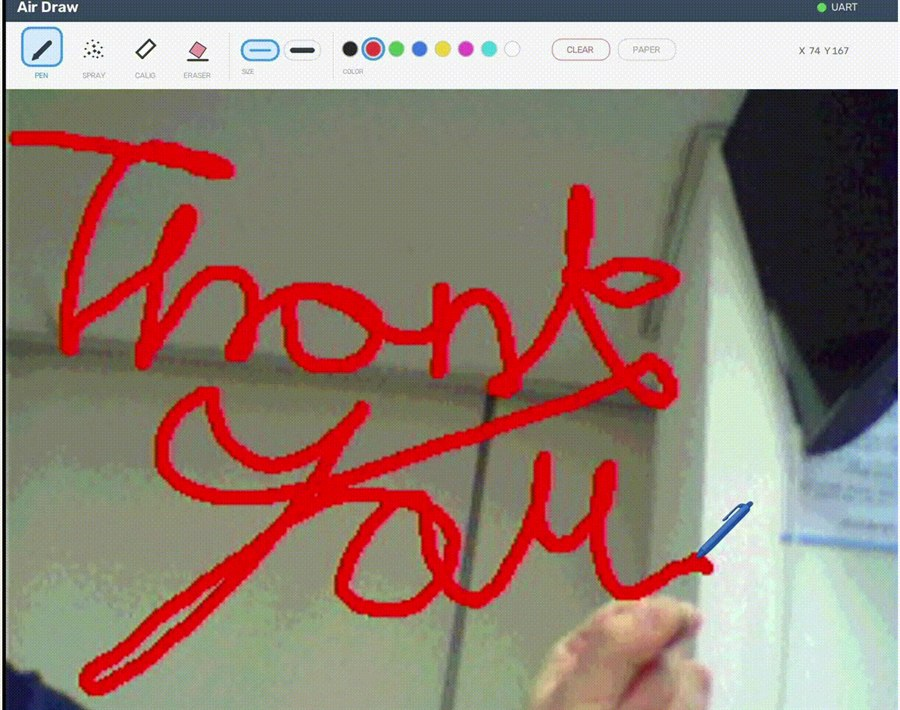
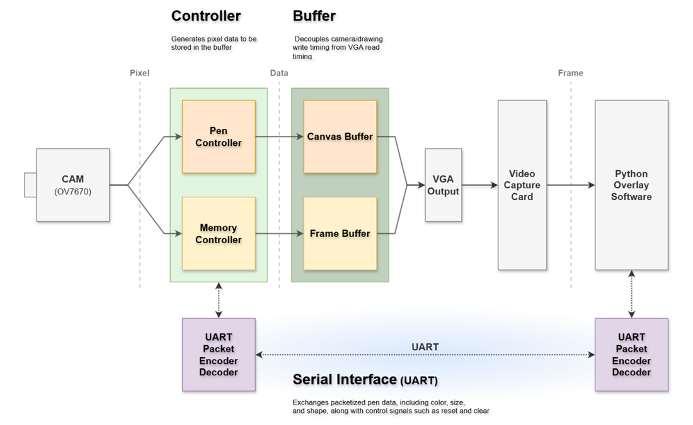
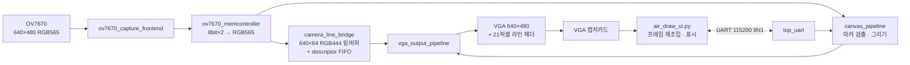
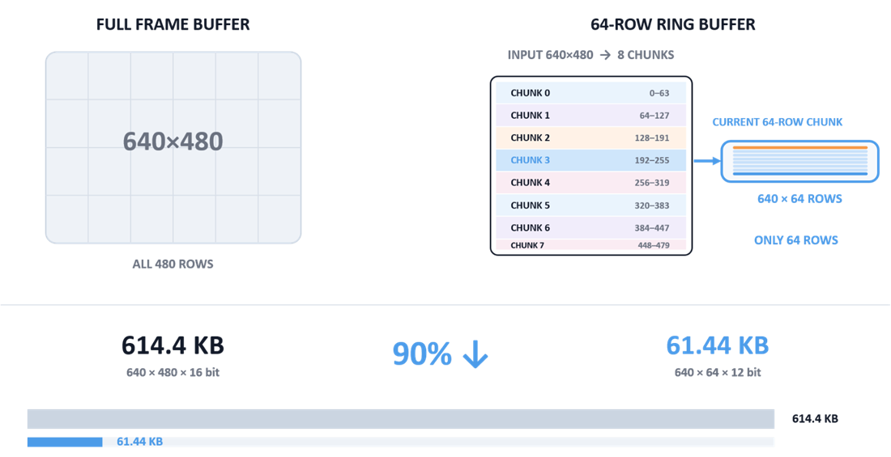
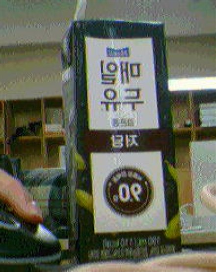
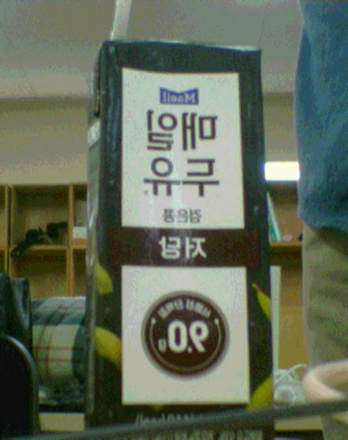

# VGA Air Drawing

OV7670 카메라로 초록색 마커를 추적해, 허공에 그린 궤적을 Basys 3 FPGA 안에서 영상과 실시간 합성하는 시스템이다. 합성된 화면은 VGA로 출력되어 캡처카드를 거쳐 PC의 파이썬 UI에 표시되고, 펜 색상·굵기·질감 설정은 UART로 양방향 전달된다.

그리기 연산은 전부 FPGA 안에서 처리한다. PC는 화면을 받아 보여주고 도구 설정을 내려보내는 역할만 한다.



## 개발 환경

| 구분 | 사용 도구 |
| --- | --- |
| 언어 | SystemVerilog, Python 3.12.10 |
| 설계·구현 | Vivado 2020.2 |
| 검증 | Synopsys VCS 2024.09-SP1, UVM 1.2 |
| 하드웨어 | Basys 3 (Artix-7 XC7A35T), OV7670 카메라 모듈, FW171 VGA 캡처보드 |

## 시스템 구성



카메라 픽셀은 두 갈래로 갈라진다. 한쪽은 **펜 컨트롤러**로 가서 마커 좌표를 찾아 캔버스에 그림을 쌓고, 다른 쪽은 **메모리 컨트롤러**를 거쳐 영상 버퍼에 들어간다. 둘은 VGA 출력 직전에 합쳐진다. 버퍼를 사이에 둔 이유는 카메라·드로잉의 쓰기 타이밍과 VGA의 읽기 타이밍을 떼어놓기 위해서다.

UART는 이 영상 경로와 완전히 분리된 채널이다. 펜 색상·크기·모양과 reset·clear 같은 제어 신호만 양방향으로 오간다.

위 구조는 v1 기준이고, v2는 **버퍼 부분만** 라인 링버퍼로 바뀌었다. 나머지 흐름은 그대로다. v2의 실제 모듈 연결은 다음과 같다.



## 저장소 구조

이 저장소에는 같은 프로젝트의 두 세대가 나란히 들어 있다. 설계 판단이 어떻게 바뀌었는지 비교할 수 있도록 둘 다 남겼다.

| 폴더 | 내용 |
| --- | --- |
| [`v2-line-header/`](v2-line-header/) | **현재 버전.** 64라인 링버퍼 + 라인 헤더 방식. RTL 41개 |
| [`v1-framebuffer/`](v1-framebuffer/) | 이전 버전. 프레임버퍼 방식. RTL 33개 |
| [`backup/`](backup/) | 초기 RTL 스냅샷 |

각 버전 폴더는 동일한 구성을 따른다.

```text
v2-line-header/
├── python_ui/
│   ├── air_draw_ui.py       # 영상 재조립, UART 통신, 드로잉 UI
│   ├── capture_probe.py     # 프레임 수신 속도 진단 도구
│   └── assets/              # 펜·스프레이·대각선·지우개 마커 이미지
├── vga_uart_project/
│   ├── vga_uart_project.xpr           # Vivado 2020.2 프로젝트
│   ├── vga_uart_project.srcs/
│   │   ├── sources_1/                 # SystemVerilog RTL
│   │   └── constrs_1/Basys-3-Master.xdc
│   ├── vga_uart_project.runs/impl_1/top_airDrawing.bit
│   └── *.rpt                          # synth/impl 타이밍·리소스 리포트
└── visualization/           # 설계 비교용 시각화 (HTML)
```

## v1 → v2: 영상을 어떻게 보낼 것인가

이 프로젝트에서 가장 크게 바뀐 판단이다.

**640×480 RGB565 한 프레임은 614.4 KB다. 이걸 담으려면 RAMB36이 최소 134개 필요한데, Basys 3에는 50개뿐이다.** 풀 프레임버퍼는 계산상 애초에 들어가지 않는다.

v1은 해상도를 낮춰 이 제약을 피했다. 320×240 QVGA로 저장해 153.6 KB를 쓴다. 대신 저장한 크기 그대로 출력하기 때문에 카메라 영상이 **640×480 화면의 좌상단 1/4에만** 나온다.

v2는 질문을 바꿨다. 프레임 전체를 들고 있을 필요가 있나? **최근 64라인만 링버퍼에 유지하고, 포맷도 RGB444로 낮춘다.** 480행을 64행씩 8개 구간으로 나눠 흘려보내는 방식이다. 이러면 61.44 KB, 이론상 RAMB36 14개면 된다. 풀 프레임 대비 **90% 감소**다.



문제는 그러면 FPGA가 "지금 이 줄이 원본의 몇 번째 줄인지"를 PC에 알려줄 방법이 필요하다는 것이다. 그래서 각 라인의 끝 **21컬럼에 헤더**를 실어 `source frame ID + source row + checksum`을 함께 내보낸다. PC의 파이썬이 이 헤더를 읽고 배열의 제자리에 꽂아 넣으면 640×480 프레임이 복원된다.

즉 **프레임 조립을 FPGA의 메모리 문제에서 PC의 소프트웨어 문제로 옮긴 것**이다. 그 결과 메모리는 줄었는데 화면은 오히려 4배 넓어졌다.

| | v1 | v2 |
| --- | --- | --- |
| 영상 버퍼 | 320×240 RGB565 프레임버퍼 | 640×64 RGB444 링버퍼 |
| 영상 payload | 153.6 KB | **61.44 KB** |
| 표시 영역 | 화면 좌상단 1/4 (320×240) | 전체 화면 (640×480) |
| 프레임 조립 | 불필요 (FPGA가 그대로 출력) | PC (파이썬이 헤더로 재조립) |
| 마커 추적 | 바운딩박스 중점 | 센트로이드 + 추적 게이트 |
| 비트스트림 | 812 KB | **735 KB** |
| RTL 모듈 | 33개 | 41개 |

### 결과: 해상도는 4배, BRAM은 더 적게

같은 장면을 두 버전으로 촬영한 결과다. 둘 다 같은 크기로 표시했다.

| v1 — 320×240 | v2 — 640×480 |
| :---: | :---: |
|  |  |

세 가지 조건으로 합성해 비교했다.

| | v1 (320×240) | v2 (320×240) | v2 (640×480, 현재) |
| --- | --- | --- | --- |
| **BRAM** | **96 %** | **36 %** | **72 %** |
| LUT | 5 % | 6 % | 7 % |
| FF | 2 % | 3 % | 3 % |
| IO | 34 % | 34 % | 35 % |

읽는 방법은 두 가지다.

**같은 해상도끼리 비교하면** — v1은 320×240만으로 BRAM 96%를 써서 사실상 한계였다. 기능을 하나 더 붙일 여유가 없었다. v2는 같은 320×240을 **36%**로 처리한다.

**현재 설정과 비교하면** — v2는 해상도를 4배 올린 640×480에서도 **72%**다. v1이 1/4 크기 화면에 쓰던 96%보다 여전히 적다. 로직 자원(LUT·FF)은 세 조건이 거의 동일하므로, 이 차이는 전부 메모리 구조를 바꿔서 얻은 것이다.

### 한 프레임이 VGA 두 화면에 나눠 실린다

카메라 한 프레임(480행)은 VGA 화면 한 장에 다 들어가지 않는다. 각 원본 행을 세로로 2번 출력하기 때문이다. 그래서 **전송 화면 A가 원본 rows 0–239를, 화면 B가 240–479를** 나눠 운반한다. A와 B는 서로 다른 프레임이 아니라 같은 원본의 위아래 절반이다.

```text
VGA 화면 A ──> 원본 rows 0…239   (각 row를 2번 출력 → 480 VGA rows)
VGA 화면 B ──> 원본 rows 240…479 (각 row를 2번 출력 → 480 VGA rows)

복제 row 1 : 영상 columns 0…639
복제 row 2 : 영상 columns 0…618 + 끝 21컬럼 헤더
```

25 MHz ÷ (800 × 521) = 59.9808 Hz이므로 한 화면이 16.67 ms, 두 화면이 33.34 ms다. 따라서 **완성 프레임 상한은 약 30 fps**이고, 현재 카메라가 약 20 fps라 전송이 병목이 되지 않는다.

### 픽셀은 도메인을 건너지 않는다

PCLK(약 15 MHz)와 VGA 출력 도메인(100 MHz) 사이를 640픽셀 전부가 건너면 CDC 비용이 커진다. v2는 **영상 픽셀을 링버퍼 bank에 남겨두고, `{카메라 row 번호, bank 번호}` descriptor만 64단 async FIFO로 넘긴다.** 출력 쪽 line streamer는 descriptor를 POP한 뒤 해당 bank에서 640픽셀을 직접 읽는다. 도메인을 건너는 건 주소뿐이다.

주소를 넘기는 시점도 화면과 겹치지 않는다. 픽셀 데이터는 display area(x 0–639)에서 흐르고, **라인 주소는 그 뒤 porch 구간(x 640–799)에서 FIFO로 넘어간다.** 어차피 비어 있는 수평 블랭킹 시간을 제어 경로에 쓴 것이다.

## 구현 결과

v2 기준, Vivado 2020.2 implementation 리포트 값이다.

| 항목 | 사용량 | 비율 |
| --- | --- | --- |
| Slice LUTs | 1,401 / 20,800 | 6.74 % |
| Slice Registers | 1,290 / 41,600 | 3.10 % |
| Block RAM Tile | 36 / 50 | 72.00 % |

BRAM 36개의 내역은 **카메라 링버퍼 24개 + 캔버스 12개**이고, 14개가 남는다.

타이밍은 셋업·홀드 모두 닫혔다. WNS **+1.519 ns**, WHS **+0.023 ns**, 실패 엔드포인트 **0개**.

카메라 동작점은 XCLK 22.980769 MHz, `CLKRC=0x02`, 실측 PCLK 약 15.15 MHz, 약 20 fps다.

**전송 경로는 20 fps보다 빠르게 돌 수 있다.** `capture_probe.py`로 측정하면 캡처 약 60 fps, 초당 14,400라인, 완성 프레임 약 28~29 fps까지 나온다. 이론 상한 29.99 fps에 거의 닿는 값이다. 다만 이 영역에서는 밝은 장면에 자홍색 점 결함이 화면 전반에 퍼진다. **속도보다 화질을 택해 `CLKRC=0x02`로 낮춘 것**이 현재 설정이다. 계산 과정은 [v2 문서 4장](v2-line-header/README.md)에 정리돼 있다.

## 검증

주요 모듈은 UVM 테스트벤치로 검증했다. 9개 모듈 전부 커버리지 100%로 통과했다.

| 모듈 | 테스트 방식 | Coverage bin | 반복 | 결과 |
| --- | --- | --- | --- | --- |
| `MemController` | 랜덤 픽셀 | RGB 조합 · 교차 | 150 | PASS (100%) |
| `UartPacketDecoder` | 랜덤 패킷 | 필드 조합 | 50 | PASS (100%) |
| `PenConfigController` | 랜덤 UART · 랜덤 물리 버튼 | 입력 조합 | 각 50 | PASS (100%) |
| `UartSender` | 랜덤 패킷 | 송신 조합 | 50 | PASS (100%) |
| `BrushStrokeController` | Pen · 지우개 · 크기 · 랜덤 | 선 생성 · Pen · 브러시 | 10,000 | PASS (100%) |
| `BresenhamInterpolator` | 랜덤 · 경계 · 회귀 | 좌표 · 선 · Cross | 1,000 | PASS (100%) |
| `BrushRenderer` | 랜덤 · 경계 · 텍스처 · 스트레스 | 브러시 · 텍스처 · 색상 | 10,000 | PASS (100%) |
| `BboxCenterAccum` | 랜덤 · 코너 케이스 · 스트레스 | 위치 · 크기 · Pen | 10,000 | PASS (100%) |
| `CoordFilter` | 기본 · Jitter · Spike · 랜덤 | Pen · 좌표 · Motion | 250 | PASS (100%) |

좌표 계열 모듈에 반복 횟수를 몰아준 이유는, 이쪽이 실패해도 시뮬레이션에서 눈에 잘 띄지 않기 때문이다. 선이 한 픽셀 어긋나거나 떨림 보정이 한 프레임 늦는 문제는 파형만 봐서는 지나치기 쉬워서 랜덤 반복으로 걸러냈다.

## 마커 추적

초록색 마커의 위치를 찾는 6단계다. 좌표 계산은 짝수 x·y만 샘플링해 320×240으로 처리한다. **영상 출력은 640×480 그대로 두고 계산량만 절반으로 줄인 것**이다.

| 단계 | 처리 | 판정 |
| --- | --- | --- |
| 1 | RGB565 픽셀 입력 | 640×480, 순서대로 도착 |
| 2 | 짝수 좌표 샘플링 | 추적 계산만 320×240 |
| 3 | 녹색 판정 | `G >= 16` && `G - max(R,B) > 8` |
| 4 | 가로 3픽셀 침식 | `hit[x-1] & hit[x] & hit[x+1]` |
| 5 | 추적 게이트 | 이전 중심에서 x·y 각각 ±48 이내만 누적 |
| 6 | 센트로이드 → 5프레임 평균 | `cx = Σx/N`, `cy = Σy/N` |

마커를 놓치면 최대 3프레임 뒤 추적을 해제한다.

**왜 바운딩박스 중점이 아니라 센트로이드인가.** v1은 검출된 녹색 픽셀의 바운딩박스 중점 `(min + max) / 2`를 썼는데, 이 방식은 멀리 떨어진 오검출 픽셀 하나가 `maxX`를 바꾸면 중심이 크게 점프한다. 센트로이드는 전체 픽셀의 평균이라 그 한 점의 비중이 `1/N`로 희석된다. 여기에 추적 게이트를 더하면 다른 초록색 물체를 애초에 누적에서 제외하므로 가장 안정적이다.

## 그리기 엔진

추적으로 얻은 좌표가 캔버스 픽셀이 되기까지의 경로다.

```text
coord_filter             앞 단계의 마커 좌표 · Pen Down/Up 판정
        ↓
brush_stroke_controller  이전 좌표와 현재 좌표를 하나의 선으로 연결
        ↓
bresenham_interpolator   두 점 사이 중심 좌표 보간
        ↓
circular_brush_renderer  중심 주변 브러시 마스크와 RAM 주소 생성
        ↓
canvas_buffer            최종 픽셀 저장
```

카메라는 프레임 단위로 좌표를 하나씩 준다. 그대로 찍으면 점이 띄엄띄엄 남으므로, `brush_stroke_controller`가 이전 좌표와 현재 좌표를 이어 선으로 만들고 `bresenham_interpolator`가 그 사이를 채운다. 마커가 사라졌다가 다시 나타나면 이전 위치와 이어지지 않도록 스트로크를 끊는다.

브러시 모양은 중심으로부터의 상대 좌표 `(dx, dy)`로 판정한다.

| 브러시 | 판정식 |
| --- | --- |
| 펜 | `dx² + dy² <= T` |
| 스프레이 | `dx² + dy² <= r²` && `hash[2:0] <= density` |
| 대각선 | `\|dy - dx\| <= w` && `\|dx\| <= r` && `\|dy\| <= r` |

## 실행 방법

**1. 비트스트림 굽기**

Vivado 2020.2에서 `v2-line-header/vga_uart_project/vga_uart_project.xpr`를 열고 Basys 3에 프로그램한다. 재합성 없이 쓰려면 이미 생성된 비트스트림을 바로 사용해도 된다.

```text
v2-line-header/vga_uart_project/vga_uart_project.runs/impl_1/top_airDrawing.bit
```

**2. 연결**

OV7670을 PMOD에 연결하고, 보드의 VGA 출력을 캡처카드에, 캡처카드와 USB-UART를 PC에 연결한다.

**3. UI 실행**

```bash
pip install -r v2-line-header/requirements.txt
python v2-line-header/python_ui/air_draw_ui.py
```

카메라 설정을 다시 보내려면 BTN_C를 누른다. 시스템 전체 리셋은 별도 리셋 입력이다.

## 문서

- [v2 상세 설계 문서](v2-line-header/README.md) — 모듈별 동작, 클록 계산 과정, 라인 헤더 규격, 프레임 재조립 순서
- [v1 CAPTURE/SAVE 구현 노트](v1-framebuffer/README_KR.md)
- [UART 패킷 규격](v1-framebuffer/vga_uart_project/vga_uart_project.srcs/README_KR.md)

### 인터랙티브 시각화

단계별로 눌러 가며 동작을 확인할 수 있는 자료다. GitHub은 HTML을 렌더하지 않으므로 내려받아 브라우저에서 열어야 한다.

- [`full-frame-vs-line-ring.html`](v2-line-header/visualization/full-frame-vs-line-ring.html) — 카메라 원본부터 링버퍼, descriptor FIFO, VGA 전송 화면 A/B, 파이썬 완성 프레임까지의 흐름
- [`green-centroid-tracker.html`](v2-line-header/visualization/green-centroid-tracker.html) — 마커 추적 6단계, 추적 게이트 동작, 바운딩박스 중점과 센트로이드 비교
